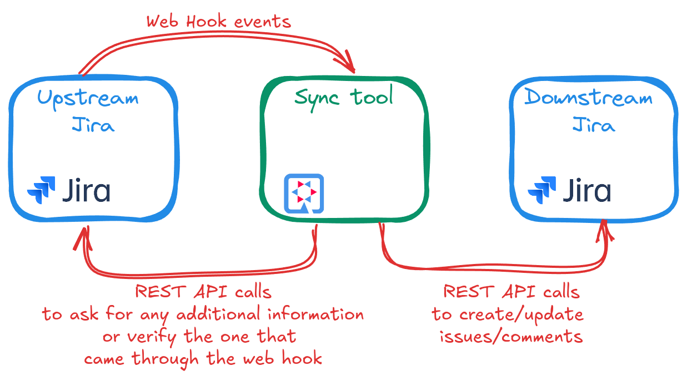

= One way Jira sync tool

The sync tool uses web hooks and Jira REST API to perform the one way sync of upstream Jira to the downstream one.
User actions in the upstream Jira trigger web hooks, which send the events to the sync tool.
Sync tool uses the REST API to get the required information from the upstream Jira and
sends it over to the downstream one.

== Project group configuration

For the tool to work with Jira it requires some configuration information defined in the
`org.hibernate.infra.replicate.jira.JiraConfig`. More suggestions on the configuration are provided in the sections below.

The app itself does not come with the project group configuration, and it expects that an additional `application.properties`
containing the configuration will be provided at runtime.

== Configuring web hooks on the upstream side

In the upstream Jira (the source/original) configure a webhook per project you want to be synced.
The tool listens for a web hook events at `/api/jira/webhooks/{PROJECT-KEY}`.

Set up the secret, while creating the web hook so that the requests could be signed and checked, see https://developer.atlassian.com/cloud/jira/platform/webhooks/#secure-admin-webhooks.
If secret was configured on the web hook side, signature verification can be enabled per project through:

[source,properties]
----
jira.project-group."project-group-name".projects.PROJECT-KEY.security.enabled=true
jira.project-group."project-group-name".projects.PROJECT-KEY.security.secret=secret-you-have-specified-in-the-web-hook
----

See also:

* https://developer.atlassian.com/server/jira/platform/webhooks/
* https://developer.atlassian.com/cloud/jira/platform/webhooks/

== User configuration

This tool requires two accounts provided per project group. One account is to access the upstream Jira while the other one
is for the downstream Jira.

Users are specified in the project group configuration in the `application.properties` file:

[source,properties]
----
jira.project-group."project-group-name".source.api-uri=https://your-upstream-jira-instance/rest/api/2
# if the Jira instance works with Basic authentication then username/PAT should be supplied:
jira.project-group."project-group-name".source.api-user.email=your-user-name-of-service-a-user
jira.project-group."project-group-name".source.api-user.token=your-personal-auth-token-for-the-above-user
jira.project-group."project-group-name".destination.api-uri=https://your-downstream-jira-instance/rest/api/2
# if the Jira instance works with bearer tokens only, and basic auth is disabled,
# specify the login kind and provide PAT:
jira.project-group."project-group-name".destination.login-kind=BEARER_TOKEN
jira.project-group."project-group-name".destination.api-user.token=$your-personal-auth-token-for-the-service-user
----

Please see the `JiraConfig` javadocs for more details on the configuration properties.

See also:

* https://confluence.atlassian.com/enterprise/using-personal-access-tokens-1026032365.html

== Further project group configuration

With users configured the next step would be to define the projects and how they are mapped.

[source,properties]
----
jira.project-group."your-project-group".projects.YOUR-SOURCE-PROJECT-KEY.project-id=downstream-project-id
jira.project-group."your-project-group".projects.YOUR-SOURCE-PROJECT-KEY.project-key=DOWNSTREAM-PROJECT-KEY
jira.project-group."your-project-group".projects.YOUR-SOURCE-PROJECT-KEY.original-project-key=UPSTREAM-PROJECT-KEY
jira.project-group."your-project-group".projects.YOUR-SOURCE-PROJECT-KEY.security.enabled=true
jira.project-group."your-project-group".projects.YOUR-SOURCE-PROJECT-KEY.security.secret=jira-webhook-secret
----

=== Mapping

The tool takes the simple approach to mapping users, issue types, etc between Jira instances.
Since all of these can differ between Jira instances, and then on top of that would be limited by the project scheme
applied to a particular project, it is simpler for the tool just to ask the user to provide the direct mapping
instead of guessing it. This section is here to provide some tips on how to get the info you need.

==== Users
Use the `jira/people/search` or `rest/api/2/user/search?username=...` to find the users.

[source,properties]
----
jira.project-group."your-project-group".users.mapping."source-user-id"=destination-user-id
----

Depending on the jira instance type you may also need to change
the property name that is used to specify the user in the downstream request.
By default, the tool will try to use the `accountId` property, but for some Jira instances you may need to send
the user id/name/smth-else through a different property, e.g. `name`. To do that add the following property:

[source,properties]
----
jira.project-group."your-project-group".users.mapped-property-name=name
----

==== Priorities
Review the project settings summary (e.g. `https://your-jira-instance/plugins/servlet/project-config/your-project-key/summary`).
Use `rest/api/2/priority` REST API to get the list of available priorities and pick the ones defined in the project scheme.

[source,properties]
----
jira.project-group."your-project-group".priorities.mapping."source-id"=destination-id
----

You may also want to provide a default priority, to be used if mapped one is not available:
[source,properties]
----
jira.project-group."your-project-group".priorities.default-value=3
----

==== Issue types
Use the project REST API `rest/api/2/project/{projectKeyOrId}` and inspect the `issueTypes` array.
Alternatively, go to your project settings page and review the project settings summary (e.g. `https://your-jira-instance/plugins/servlet/project-config/your-project-key/summary`).
Get the info from upstream/downstream projects and build a mapping in the `application.properties` file as:

[source,properties]
----
jira.project-group."your-project-group".issue-types.mapping."source-id"=destination-id
----

==== Statuses
Issue status cannot be set directly through a REST API call. Instead, to change the issue status a transition has to be applied.
That's why upstream issue statuses are mapped to downstream transitions.
To find the list of statuses review the result of ``

To find the list of transitions available for your project see, try `/api/2/issue/{issueIdOrKey}/transitions`

Note: only a single transition is going to be applied. Hence, make sure that the workflow allows to apply transitions from any state.

[source,properties]
----
jira.project-group."your-project-group".statuses.mapping."source-status-id"=destination-transition-id
----

==== Issue link types
Use the project REST API `rest/api/2/issueLinkType` and build the mappings.
Get the info from upstream/downstream projects and build a mapping in the `application.properties` file as:

[source,properties]
----
jira.project-group."your-project-group".issue-types.mapping."source-id"=destination-id
----

Note, creating sub-task is not supported by the tool, as there is no way of converting a task to a sub-task through
REST at the moment. Hence instead a sub-task is created as a task, and an extra issue link is created for it of a type
configured via a property:

[source,properties]
----
jira.project-group."your-project-group".issue-link-types.parent-link-type=destination-id
----

== Recommended Downstream project configuration

* Make sure the mapped users are added to the project
* Assign the project users to the "viewer-only" role that does not have edit permissions to prevent accidental edits.
Any updates/comments should be added to the upstream Jira tickets and synced through the tool.
* Service account used by the tool for communication with the downstream Jira should be assigned to the project admin
role, so it could leverage the `notifyUsers` query parameter where possible.
* Disable email notifications for the project. Most likely you would need to request your Jira administrator to adjust the
notification scheme for the downstream project (see https://your-jira-instance/plugins/servlet/project-config/your-project-key/notifications).
If for some reason the notifications have to be kept enabled, consider adjusting the scheme so that notifications for
comments/issues/transitions updates do not include current assignee or reporter.
While the sync tool tries to leverage the `notifyUsers` parameter to prevent emails
from being sent after the actions the tool perform, not all requests respect this parameter and emails may be sent out anyway.

== Deployment

Currently, the tool is deployed to an OpenShift. Deployment happens automatically when pushed to the `production` branch.
See a corresponding GitHub action for details.

=== Initial set up

1. Add your OpenShift server url as a `OPENSHIFT_SERVER_INFRA_PROD` GitHub secret.
See link:.github/workflows/deploy.yml[].
2. Create a service account on OpenShift that will be used by the GitHub deploy action.
+
[NOTE]
====
With recent versions of OpenShift the token may not be automatically generated for the service account,
if that's so create one manually, e.g. create a token valid for a week:

----
oc create token <serviceaccountname> --duration=$((7*24))h
----

See also:

* https://docs.openshift.com/container-platform/4.11/release_notes/ocp-4-11-release-notes.html#ocp-4-11-notable-technical-changes)
* https://docs.openshift.com/container-platform/4.17/authentication/bound-service-account-tokens.html#bound-sa-tokens-configuring-externally_bound-service-account-tokens
====
+
Having the service account token ready, add it to the GitHub secretes as `OPENSHIFT_TOKEN_INFRA_PROD`
See link:.github/workflows/deploy.yml[].
+
3. The OpenShift namespace needs to be added as a `OPENSHIFT_NAMESPACE_INFRA_PROD` GitHub secrete.
See link:.github/workflows/deploy.yml[].
4. Create and fill OpenShift Config maps and secrets.
    These configs will depend on your `application.properties` configuration
    and what project groups were defined.
    `replicate-jira-config`::
    Environment variables for the application.
     +
    Put in there whatever configuration you need for your specific cluster.
    `replicate-jira-secrets`::
    Secret environment variables for the application.
     +
    Put in there whatever secret configuration you need for your specific cluster.
     +
    In particular, any REST API tokens, management passwords, Web Hook secrets.
5. Create an `application.properties` with the project group configuration and push it to your config repository.
Have a simple workflow in that repository to convert the `application.properties` to a ConfigMap on the OpenShift cluster,
e.g. using next `oc` commands:
+
[source,yaml]
----
# try to create the config map first, but most likely it is already there, if it not a first deploy ever
oc create configmap <your-config-map-name> --from-file=<relative path within your config repo to>/application.properties || true
# update the app configuration:
oc set data configmap/<your-config-map-name> --from-file=<relative path within your config repo to>/application.properties
----
+
Make sure to provide the names for the required config maps while building the image through
+
[source,yaml]
----
# here <your-config-map-name> is the name of the ConfigMap containing your application.properties with the project group configuration.
-Dquarkus.openshift.env.configmaps=<your-config-map-name>,<your-other-config-map-name>... \
-Dquarkus.openshift.config-map-volumes.app-config.config-map-name=<your-config-map-name> \
----

== Route configuration

We are not adding a route as part of the build since setting the path is currently unsupported.
Create a route either with `oc` or through a UI using the OpenShift console.
Make sure to set the next spec properties:

[source,yaml]
----
spec:
  host: your-host.smth
  path: /path-to-use
  to:
    kind: Service
    name: your-replicate-jira-service-name
  port:
    targetPort: http
  tls:
    termination: edge
    insecureEdgeTerminationPolicy: Redirect
  wildcardPolicy: None
----

Note that certificates are not provided explicitly. To fully enable https and finish route configuration
add the following annotations to the route:

[source,yaml]
----
# will mark the resource as such that certificates will be generated for it:
# see https://github.com/tnozicka/openshift-acme/#enabling-acme-certificates-for-your-object
kubernetes.io/tls-acme: 'true'
# Set the target to root so that the path `/path-to-use` is not passed to the service:
haproxy.router.openshift.io/rewrite-target: /
----

== Management endpoints

There are management endpoints to sync particular issues/comments.

NOTE: TODO: Need to make sure that POST management endpoints actually work before describing all of them here...

== Local development

To run the app with a dev/prod configuration, create corresponding `application.properties` file, or clone them from
your app configuration repository and point to it with `-Dquarkus.config.locations=/path/to/your/config/application.properties`.

Most likely this config file will have some env variables for any secrets. To provide values for those, create an `.env`
file in the root of the repository and add the required variables to it, e.g.:

----
JIRA_API_URL_HIBERNATE=https://hibernate.atlassian.net/rest/api/2
JIRA_API_USER_HIBERNATE=your-user
JIRA_API_TOKEN_HIBERNATE=your-PAT

JIRA_API_URL_REDHAT=https://hibernate.atlassian.net/rest/api/2
JIRA_API_USER_REDHAT=your-user
JIRA_API_TOKEN_REDHAT=your-PAT
----

We also use https://smee.io/ to get web hooks delivered to the local env.

== Troubleshooting

Sometimes attempting to make REST requests to Jira API may result in an `Internal Server Error` without much additional
details, e.g.:
[source,json]
----
{
    "errorMessages": [
        "Internal server error"
    ],
    "errors": {}
}
----

If the request constantly fails even after several retries, it most likely mean that the request contains some fields
that are not present on the "view" the rest request is trying to update. To help track down the reason behind it:

- Enable the request/response logging for a particular rest client (most likely for the "destination" one):
+
[source,json]
----
jira.project-group."<your-project-group-name>".destination.log-requests=true
----
+
- Get the request body of the failing request
- Use your favorite tool for sending REST requests to send a failing request "manually"
- Start removing any fields from the JSON that are "optional" and send requests with modified JSON
  * Keep doing so until you identify the field causing the problem

[[license]]
== License

This project is licensed under the Apache License Version 2.0.
